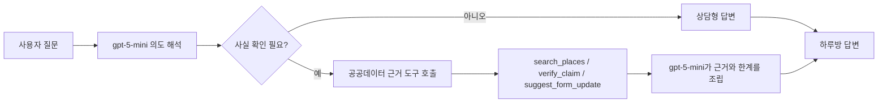

# 하루방 에이전트 구현 문서

## 목적

하루방 에이전트는 제주를 담다의 대화형 여행 조율자다. 프리 아이펠톤 규정의 핵심인 `gpt-5-mini + RAG` 구조를 서비스 경험 안에서 보여주되, 사용자에게는 내부 구현 용어가 아니라 "공공데이터 근거를 확인한 답변"으로 전달한다.

## 설계 원칙

1. gpt-5-mini가 먼저 사용자의 질문 의도와 여행 맥락을 해석한다.
2. 장소 추천, 장소 개수, 특정 지역 후보, 리뷰 검증처럼 사실 확인이 필요한 질문에는 공공데이터 근거 도구를 호출한다.
3. 준비물, 서비스 사용법, 여행 판단 기준처럼 새 사실 조회가 필요 없는 질문은 gpt-5-mini가 바로 답한다.
4. 장소명, 주소, 운영시간, 개수는 도구 결과나 폼 컨텍스트 밖에서 생성하지 않는다.
5. 사용자 화면에는 `DB/RAG`, `tool`, `도구 호출` 같은 내부 표현을 노출하지 않는다.

## 현재 구현 구조

## 도구 역할

- `search_places`: 지역과 카테고리 기준으로 공공데이터 후보 수와 일부 후보를 조회한다.
- `verify_claim`: 사용자가 본 리뷰나 문장을 공공데이터와 대조해 검증한다.
- `suggest_form_update`: 사용자의 폼에 반영할 변경안을 제안한다. 실제 반영은 사용자 승인 후 프론트에서 처리한다.

## 답변 정책

하루방 에이전트의 답변은 다음 순서를 따른다.

1. 사용자의 질문에 대한 직접 답변
2. 현재 여행 조건이나 목적을 반영한 이유
3. 제주를 담다가 확인한 공공데이터 기준과 확인하지 못한 한계
4. 다음에 좁히면 좋은 선택지 1개

예시:

> 제주시에서 한식 위주로 찾으시면 먼저 후보를 넓게 볼 수 있어요. 현재 선택하신 여행 조건에서는 조용한 카페보다 현지 맛집 후보가 더 많이 확인됩니다. 제주를 담다가 확인한 공공데이터 기준으로는 후보가 충분하지만, 영업시간 같은 실시간 정보는 방문 전 한 번 더 확인하는 편이 좋습니다. 한식, 카페, 부모님 동행 중 하나로 좁혀드릴까요?

## 프리 아이펠톤 평가 항목 연결

| 평가 영역 | 하루방 에이전트 반영 |
| --- | --- |
| 문제 정의·기획 | 제주 여행 정보의 과장·불확실성을 줄이고, 사용자가 조건에 맞는 후보를 고르게 돕는다. |
| 모델 설계·활용 | gpt-5-mini가 질문을 해석하고, RAG 도구로 조회한 공공데이터 근거를 답변에 결합한다. |
| 서비스 견고성 | API 키 오류나 일시적 OpenAI 오류가 사용자에게 원문으로 노출되지 않도록 짧은 재시도 메시지를 제공한다. |
| 신뢰성·설득력 | 장소명·개수·검증 결과는 도구 결과 안에서만 사용하고, 확인되지 않은 정보는 한계로 분리한다. |
| 보안 | API 키는 환경변수로만 사용하며, 프론트에는 키나 원문 오류를 노출하지 않는다. |

## 다음 고도화 후보

- 하루방 답변에 사용된 근거 도구 trace를 발표용 대시보드에 요약 표시
- 질문 유형별 골든셋 추가: 추천, 개수, 리뷰 검증, 폼 수정, 일반 상담
- `search_places` 결과에 trust_score breakdown을 더 짧게 포함해 답변 품질 강화
- 날씨 질문 전용 도구를 하루방에 연결해 여행 기간 날씨 요약 답변 제공
